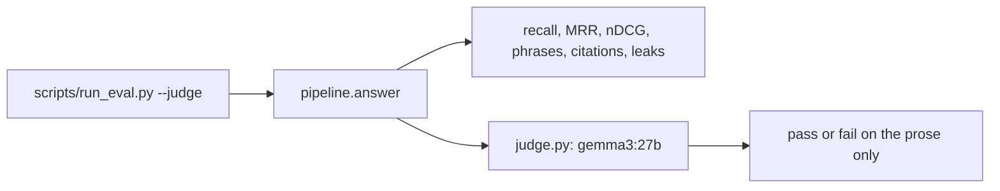

# How this RAG app works

This is a **question-answering program** over the Doofenshmirtz Evil Inc handbook.

You put policy files in `docs/`. The program cuts them into small pieces (chunks), turns each piece into numbers (an embedding), and stores those numbers. Later you type a question. The program finds the closest pieces and asks a local language model to answer **only from those pieces**, then adds citations for the passages the answer actually used.

There is no public website required. You can run it from the terminal, or open a local page with `python -m rag.server`.

---

## The two jobs

Think of two separate jobs. They share the same store.

| Job | Command | What happens |
| --- | --- | --- |
| **Fill the library** | `python -m rag.ingest` | Read `docs/` → chunk → embed → save in Chroma or Pinecone |
| **Ask a question** | `python -m rag.retrieve "…"` | Embed the question → search → rerank → write an answer |

`python -m rag.trace "…"` is the same ask-job, plus a timing/cost table.

---

## Entire flow (every step)

Read top to bottom. The left column fills the library. The right column answers one question. They meet at the vector store.

```mermaid
flowchart TB
  subgraph start["Start"]
    You["You"]
  end

  You -->|python -m rag.ingest| Docs
  You -->|python -m rag.retrieve / trace / server| Q

  subgraph ingest["1. Fill the library"]
    Docs["docs/ PDF DOCX MD + manifest.json"]
    Name["Filename → policy name + version"]
    Hash{"Same bytes, chunker, extractor and embedding model?"}
    Skip["Skip this file"]
    Meta["Manifest-only change: update labels, no re-embed"]
    Read["Read text. Numbered sentences stay in the section. Prose before the first heading is a Preamble."]
    Chunk["Cut into chunks. Section bodies and parent_text are kept."]
    Labels["Add clause type and entities"]
    Valid["Validate each chunk"]
    Abort["Stop. Store unchanged"]
    EmbedDoc["Ollama embeddinggemma: vector for each chunk, before any write"]
    Write["Replace only this policy+version. Retry the write twice."]
    Missing["File gone from docs/: delete its chunks and clear the cache"]
    Life["Mark latest version and effective dates"]
    Docs --> Name --> Hash
    Hash -->|yes, labels changed| Meta
    Hash -->|yes, nothing changed| Skip
    Hash -->|no| Read --> Chunk --> Labels --> Valid
    Valid -->|bad chunk| Abort
    Valid -->|ok| EmbedDoc --> Write --> Life
    Life --> Missing
  end

  Store[("Vector store: Chroma or Pinecone")]
  Meta --> Store
  Life --> Store
  Skip --> Store
  Missing --> Store

  subgraph ask["2. Ask a question"]
    Q["Question string"]
    Gate["Strip 6-letter access phrase if it matches"]
    Level["Access: default or restricted"]
    EmbedQ["Ollama embeddinggemma: question vector"]
    Catalog["Load catalog this access level may see"]
    CacheHit{"Close embedding, same content words, same access, same corpus?"}
    Cached["Reuse saved answer"]
    Route["gemma3:4b: lookup or compare, which policy or policies"]
    Q --> Gate --> Level --> EmbedQ --> Catalog --> CacheHit
    CacheHit -->|yes| Cached
    CacheHit -->|no| Route
  end

  subgraph search["3. Find passages"]
    Kind{lookup or compare?}
    Multi["Optional: rewrite into extra queries"]
    Dense["Dense ANN search in the store"]
    BM25["BM25 over every chunk the filter allows"]
    RRF["RRF: mix the ranked lists"]
    Rerank["Cohere rerank by default"]
    MMR["MMR: drop near-duplicates"]
    Low{"Scores too low, or nothing retrieved?"}
    Retry["Rewrite once and search again"]
    NotFound["kind = not_found"]
    Hits["Top chunks or version pairs"]
    Route --> Kind
    Kind --> Multi --> Dense
    Multi --> BM25
    Dense --> RRF
    BM25 --> RRF --> Rerank --> MMR --> Low
    Low -->|yes, first try still has hits| Retry --> Dense
    Low -->|still low, or no hits| NotFound
    Low -->|no| Hits
  end

  Store -.->|search + catalog| Dense
  Store -.->|BM25 reads the filtered chunks| BM25
  Store -.-> Catalog

  subgraph answer["4. Write the answer"]
    Sib["Lookup only: add the other chunks of that section"]
    Expand["Optional: hand the model the parent section text"]
    Order["Optional: lost-in-the-middle reorder"]
    Empty{"Passages found?"}
    Fixed["Fixed sentence: no matching policy text"]
    Gen["gemma3:12b writes the answer from passages only"]
    Cite["Cite passages the answer used. If none overlap, cite all."]
    SaveCache["Store question text with the semantic cache entry"]
    SaveLast["Write .rag/last_answer.json"]
    Out["Print answer or show it on the local page"]
    Hits --> Sib --> Expand --> Order --> Empty
    NotFound --> Empty
    Empty -->|no| Fixed --> Out
    Empty -->|yes| Gen --> Cite --> SaveCache --> SaveLast --> Out
    Cached --> Out
  end
```



Same path as a numbered list:

1. **Ingest** reads each handbook file. A file is skipped when its bytes, chunker, extractor, embedding model and Matryoshka setting are unchanged. Changed files are chunked and embedded before the first write. Each document write is retried twice. A file removed from `docs/` is deleted from the store and the semantic cache is cleared. Then “which version is latest” is updated.
2. **Ask** strips the access phrase, embeds the question, loads the catalog, and returns a cached answer only when the embedding is close **and** the content words, numbers, versions and dates match.
3. **Route** decides lookup vs compare. A question that names more than one policy is a lookup over those policies. Broken or non-JSON router output falls back to a lookup with no policy.
4. **Search** may rewrite the question, runs vector search and BM25 over every chunk the filter allows, fuses with RRF, reranks, diversifies with MMR, and retries once if scores are weak. An empty compare, or a lookup that still finds nothing, is `not_found`.
5. **Answer** pulls in sibling chunks of a lookup hit, optionally swaps in parent-section text, reorders passages, calls the big model only if something was found, cites the passages the answer used, then saves cache + last answer.

Scoring answers with a second model is **not** part of this path. `python scripts/run_eval.py --judge` runs the same ask path, then asks local `gemma3:27b` whether the prose answers the question.

---

## Where the data lives


```
docs/                  handbook files (PDF, Word, Markdown) + docs/manifest.json
chroma/                local vector store (gitignored), default backend
Pinecone               optional cloud store (RAG_DB_BACKEND=pinecone)
.rag/                  cache, last answer, feedback (gitignored)
.env                   keys and settings (gitignored)
src/rag/               the brain (chunk, search, answer)
src/adapter/           plugs to Ollama, Chroma, Pinecone, Cohere
```

A stored chunk looks like:

- **id** — `Policy Name|1.0|3. Leave > 3.1 Days`
- **text** — the passage
- **vector** — numbers that mean the same thing as the text
- **metadata** — policy, version, heading, classification, dates, department, `parent_text` (the section the passage came from), …

On Pinecone, a record that would exceed the metadata limit drops `parent_text` first, then shortens `text`, so the write still succeeds.

---

## Data flow: ingest (library filling)

```
docs/*.pdf *.docx *.md
        │
        ▼
  reader.py          filename → policy + version
                     numbered sentences stay in the current section
                     prose before the first heading → Preamble
        │
        ▼
  chunking.py        sections / overlapping pieces
                     nonempty section bodies are indexed
                     parent_text stored for later expansion
        │
        ▼
  extract.py         extra labels: clause type, entities
        │
        ▼
  validate.py        every chunk must match the Chunk model
        │
        ▼
  embedding_adapter  Ollama embeddinggemma → vector
                     all vectors exist before the first write
        │
        ▼
  factory.py         Chroma (local) or Pinecone (cloud)
                     each document write retried twice
        │
        ▼
  lifecycle.py       mark which version is latest; set effective dates
                     files missing from docs/ are deleted; cache cleared
```

Rules that matter:

1. The **filename** is the identity: `Doofenshmirtz Evil Inc - HR Policy v3.0.md`.
2. Unchanged files (same bytes + chunker + extractor + embedding model + Matryoshka setting) are **skipped**. A manifest-only change updates labels and does not re-embed.
3. A changed file replaces **only its own** chunks, not other versions. The write is retried twice.
4. Older versions stay in the store so “what changed from v1 to v3?” still works.
5. A file removed from `docs/` is deleted on the next ingest, and the whole semantic cache is cleared.
6. Top-secret files are labeled in metadata. They are not hidden by prompting.

---

## Application flow: asking a question

This is the path for `python -m rag.retrieve "How many days of pet leave?"`.

```
you type a question
        │
        ▼
retrieve.main  ──builds──►  pipeline.build_components
        │                         │
        │                         ├─ EmbeddingAdapter   (Ollama)
        │                         ├─ GenerationAdapter  (router gemma3:4b)
        │                         ├─ GenerationAdapter  (answer gemma3:12b)
        │                         ├─ open_database      (Chroma or Pinecone)
        │                         ├─ build_reranker     (Cohere by default)
        │                         └─ SemanticCache
        ▼
pipeline.answer
        │
        ├─ 1. access.py      strip the 6-letter phrase; decide default vs restricted
        ├─ 2. embed          question → vector
        ├─ 3. catalog        policies this access level may see; corpus fingerprint
        ├─ 4. cache.py       reuse only if cosine, content tokens, access and corpus match
        ├─ 5. retrieve.py    find passages (see search steps below)
        ├─ 6. siblings       lookup: add the other chunks of the same section
        ├─ 7. algorithms     optional: parent text, then lost-in-the-middle reorder
        ├─ 8. generate.py    local model writes the answer; cite passages it used
        └─ 9. cache store    save the answer and the question text
        │
        ▼
printed answer + citations
feedback.save_last  →  .rag/last_answer.json
```

### Search steps inside `retrieve.py`

```
route (lookup or compare; several named policies → lookup)
        │
        ▼
maybe rewrite the question into a few variants (multi-query)
        │
        ▼
dense search     nearest vectors in the store, per query
BM25             word overlap on every chunk the filter allows
        │
        ▼
RRF fusion       mix the ranked lists
        │
        ▼
rerank           Cohere (or local / none)
        │
        ▼
MMR              drop near-duplicates
        │
        ▼
self-correct     weak scores: rewrite once and search again
                 still nothing, or an empty compare: "not found"
```

**Lookup** = a fact question. Returns up to a few chunks. After search, the other chunks of that section are added so a neighboring rule is present.

**Compare** = “what changed between versions?” Returns paired current/previous sections. It does not pull siblings or parent text. No pairs means `not_found`.

If nothing useful is found, the answer is a fixed sentence. The answer model is not called.

---

## Who talks to the outside world

| Need | Who | File |
| --- | --- | --- |
| Embeddings | Ollama `embeddinggemma:latest` | `adapter/embedding_adapter.py` |
| Route the question | Ollama `gemma3:4b` | `adapter/generation_adapter.py` + `rag/router.py` |
| Write the answer | Ollama `gemma3:12b` | `adapter/generation_adapter.py` + `rag/generate.py` |
| Judge an eval answer | Ollama `gemma3:27b` (only with `--judge`) | `adapter/generation_adapter.py` + `rag/judge.py` |
| Rerank passages | Cohere `rerank-v3.5` | `adapter/rerank_adapter.py` |
| Store vectors | Chroma or Pinecone | `adapter/database_adapter.py` / `pinecone_adapter.py` |

Tests and `scripts/run_eval.py` (without `--live`) use fakes instead of those services. `--judge` still calls local Ollama for the verdict.

---

## Access in one picture

```
question:  "ABCDEF: What is the Perry trap code name?"
                 │
                 ▼
         parse_access
                 │
        phrase matches RAG_ACCESS_PHRASE?
           /              \
         yes               no
          │                 │
     level=restricted    level=default
     question without    whole question
     the phrase          unchanged
          │                 │
          ▼                 ▼
   search public +       search public +
   internal +            internal only
   top-secret
```

The phrase never goes to the router, the answer model, the cache key text, logs, or feedback.

---

## Other doors into the same pipeline

| Command | What it is |
| --- | --- |
| `python -m rag.server` | Local web page. `POST /ask` calls the same `pipeline.answer`. Citations on the page are the ones marked used. |
| `python -m rag.feedback up\|down` | Rates `.rag/last_answer.json`. |
| `python -m rag.admin list\|retire\|restore\|purge` | Document lifecycle without re-ingest. |
| `python -m rag.cache purge` | Clears the semantic cache file. |
| `python scripts/demo.py` | Offline walkthrough (no Ollama). |
| `python scripts/run_eval.py` | Scores a fixed question list. |
| `python scripts/run_eval.py --judge` | Same scores, then `gemma3:27b` judges the prose. |

The judge is outside the ask path:



The judge sees the question and the answer prose. It does not see the retrieved passages or the citation block.

---

## Folder map

```
src/rag/        domain logic (read, chunk, search, answer)
src/adapter/    plugs to other software (the misspelled src/adpater/ is only an old alias)
docs/           source handbook
scripts/        demo, eval, corpus generator
tests/          automated tests
```

---

## What each code file does, and what it calls

“Calls” here means **this project’s Python files**, not the standard library.

### The ask path (`src/rag/`)

| File | Job in plain words | Calls |
| --- | --- | --- |
| `pipeline.py` | One function `answer()` that runs the whole ask path and returns answer + trace. `build_components()` wires the plugs. After retrieval it adds section siblings, optional parent text, then optional lost-in-the-middle order. | `access`, `algorithms`, `cache`, `config`, `generate`, `logutil`, `retrieve`, `tracing`; lazily `adapter.embedding_adapter`, `adapter.factory`, `adapter.generation_adapter`, `rerankers` |
| `retrieve.py` | Find the right chunks. Dense ANN plus BM25 over every filtered chunk. Also the CLI `python -m rag.retrieve`. | `lifecycle`, `access`, `algorithms`, `config`, `logutil`, `router`, `version`; CLI also `feedback`, `pipeline` |
| `trace.py` | CLI `python -m rag.trace` — same as retrieve with timings on. | `retrieve` |
| `router.py` | Ask the small model: lookup or compare, which policy or policies, which version. Reads JSON even inside a code fence. Several policies become a lookup. | `config`, `logutil` |
| `generate.py` | Ask the large model to write the answer from passages. Cite a hit when the answer shares its content words or a number; otherwise cite every hit. | `config`, `logutil` |
| `judge.py` | Eval only. `gemma3:27b` says whether the prose answers the question. | `config`; lazily `adapter.generation_adapter` |
| `access.py` | Phrase gate and classification filter. | `config`, `logutil` |
| `cache.py` | Remember similar questions (vector + content tokens + access level + corpus fingerprint). Stores the question text with the entry. | `algorithms`, `logutil` |
| `algorithms.py` | Pure ranking math: RRF, MMR, lost-in-the-middle, version targeting, dates in the question. | `version` |
| `filters.py` | Metadata filters (`$eq`, `$in`, dates, …) for both stores. | *(none in this repo)* |
| `lifecycle.py` | Which version is latest; which version was in force on a date. | `logutil`, `manifest`, `version` |
| `server.py` | Local HTTP desk (`/`, `/ask`, `/feedback`, `/health`). The page hides hits that were not cited. | `retrieve`; lazily `pipeline`, `feedback` |
| `feedback.py` | Save last answer; thumbs up/down. | `access`, `config` |
| `evaluate.py` | Run the fixed question list and score it. Optional LLM judge on the prose. Retrieval scores use the list from before siblings are inserted. | `access`, `metrics`, `pipeline`, `retrieve` |
| `metrics.py` | Recall, MRR, nDCG helpers. | `retrieve` (canonicalize) |
| `offline.py` | Fake embedder + heuristic router for tests/demo/CI. | `algorithms`; lazily `ingest`, `pipeline`, `rerankers` |
| `rerankers.py` | Pick Cohere / local / ensemble / none, with fallback. | `config`, `logutil`, `tokens`, `tracing`; lazily `adapter.rerank_adapter` |
| `matryoshka.py` | Optional two-stage search (short vectors first, full vectors later). | `algorithms`, `logutil` |
| `config.py` | Models, paths, `.env` reader, `Settings`. Judge model is `gemma3:27b`. | *(none in this repo)* |
| `logutil.py` | Step logs and per-stage timing. | *(none in this repo)* |
| `tracing.py` | Per-step latency, tokens, USD. | `config` |
| `tokens.py` | Cheap token count estimate. | *(none in this repo)* |
| `version.py` | Sort and normalize `1.0` / `v1`. | *(none in this repo)* |

### The ingest path (`src/rag/`)

| File | Job in plain words | Calls |
| --- | --- | --- |
| `ingest.py` | CLI `python -m rag.ingest`. Scan docs, skip unchanged, embed, upsert with two retries, fix lifecycle, delete files that are gone. The file hash includes the embedding model. | `adapter.embedding_adapter`, `adapter.factory`, `extract`, `lifecycle`, `access`, `chunking`, `config`, `logutil`, `manifest`, `reader`, `validate` |
| `reader.py` | Filename contract + pull text from PDF/DOCX/MD. A numbered sentence is not a heading. Long prose before the first heading becomes a Preamble. | `logutil` (+ LlamaIndex for PDF/DOCX) |
| `chunker.py` | Original parent/child chunker (still used as a helper). Nonempty section bodies are embedded. | `logutil`, `reader` |
| `chunking.py` | Newer strategies: structural, recursive, parent-child, contextual, table-aware. Stores `parent_text` on leaves. CLI stats/export. | `chunker`, `logutil`, `reader`, `tokens` |
| `extract.py` | Label chunks (heuristic or LLM). | `logutil`; LLM path lazily `adapter.generation_adapter`, `config` |
| `validate.py` | Fail ingest if a chunk is missing required fields. One check per chunk. | `logutil`, `models` |
| `models.py` | Pydantic `Chunk` shape. | *(none in this repo)* |
| `manifest.py` | Read `docs/manifest.json` (department, dates, classification). | `access` |
| `admin.py` | CLI `python -m rag.admin` retire / restore / purge / list. | `adapter.factory`, `lifecycle`, `config`, `version` |

### Plugs (`src/adapter/`)

| File | Job in plain words | Calls |
| --- | --- | --- |
| `factory.py` | Open Chroma or Pinecone; wrap with Matryoshka if configured. | `database_adapter`, `pinecone_adapter`, `config`, `logutil`; lazily `rag.matryoshka` |
| `database_adapter.py` | Local Chroma store. | `records`, `config`, `filters`, `logutil`, `tracing` |
| `pinecone_adapter.py` | Pinecone store with the same methods as Chroma. Oversized metadata drops `parent_text`, then shortens chunk text. | `records`, `config`, `filters`, `logutil`, `tracing`, `version` |
| `records.py` | Turn a chunk dict into store metadata and back. | `version` |
| `embedding_adapter.py` | Ollama embeddings. | `config`, `logutil`, `tokens`, `tracing` |
| `generation_adapter.py` | Ollama generate (router, answerer, and the eval judge). | `config`, `logutil`, `tokens`, `tracing` |
| `rerank_adapter.py` | HTTP call to Cohere rerank. | `config`, `logutil`, `tokens`, `tracing` |
| `__init__.py` | Re-exports the adapter classes. | the files above |
| `src/adpater/` | Old misspelled name. Forwards to `adapter`. Do not add new code here. | `adapter` |

### Scripts

| File | Job | Calls |
| --- | --- | --- |
| `scripts/demo.py` | Offline tour of the pipeline | `rag.offline`, `rag.pipeline`, … |
| `scripts/run_eval.py` | Offline or live eval report. `--judge` adds `gemma3:27b`. | `rag.evaluate`, `rag.offline`, `rag.judge`, `tests/eval_set` |
| `scripts/generate_corpus.py` | Rebuild the fake handbook in `docs/` | `scripts/corpus/*` |
| `scripts/corpus/*.py` | Text for each department’s generated docs | each other via `scripts/corpus/__init__.py` |

Tests live in `tests/` and call the same modules with fakes (no live Ollama/Cohere in the default `pytest` run).

---

## Call graph (who starts whom)

```
python -m rag.ingest
    ingest.py
        reader → chunking → extract → validate
        embedding_adapter
        factory → database_adapter | pinecone_adapter
        lifecycle
        cache clear, when a file was removed from docs/

python -m rag.retrieve / rag.trace
    retrieve.main
        pipeline.build_components
            embedding_adapter, generation_adapter, factory, rerankers
        pipeline.answer
            access → embed → catalog → cache
            → retrieve → siblings → parent text → reorder → generate
                retrieve → router, algorithms, lifecycle, rerankers
                rerankers → rerank_adapter (Cohere)

python -m rag.server
    server.Desk.ask
        pipeline.answer   (same as above)
        feedback.save_last

python scripts/run_eval.py --judge
    evaluate.py
        pipeline.answer   (same ask path)
        judge.py → generation_adapter (gemma3:27b)
```

---

## A question, as data

Example: `ABCDEF: How many days of pet leave for a platypus?`

1. **String in** with a phrase prefix.
2. **Access** becomes `{level: restricted, question: "How many days…"}` if the phrase matches.
3. **Vector** of that cleaned question.
4. **Catalog** of policy names the current access level may see. Its fingerprint is part of the cache key.
5. **Cache check** — cosine at least 0.95, and the same content words, numbers, versions and dates. A near-paraphrase that adds or drops a content word is a miss.
6. **Route JSON** like `{"kind": "lookup", "policy": "HR Policy", "version": ""}`. Several catalog names arrive as `policies` and are searched as one lookup.
7. **Hits** — a short list of chunks with text, scores, metadata, then the other chunks of that section.
8. **Answer string** plus citation lines like `HR Policy 3.0, 4. Pets`, only for passages the answer used.
9. **Trace table** — time and cost per step.
10. **Last-answer file** so you can run `python -m rag.feedback up`.

That is the whole loop: documents become chunks; a question becomes a vector; vectors and keywords pick chunks; chunks ground an answer.
