# Doofenshmirtz Evil Inc RAG — Architecture Brief

**System:** `doofenshmirtz-evil-incorporated-rag` 0.1.0
**Shape:** local, three-command retrieval-augmented generation over versioned company policies
**Audience:** whiteboard walkthrough for a senior software architect and a CTO

This document is the operating picture of the code in `src/rag` and `src/adpater`. Each workflow below is a diagram that can be redrawn on a whiteboard. The last diagram is the same pipeline on one board. The final section explains how each technology in the pipeline works.

## 1. What the system is

This is a batch RAG pipeline with three command-line entry points and no HTTP service. It turns a directory of policy PDFs and Word documents into a Chroma collection, then answers one question at a time from that collection.

```bash
python -m rag.ingest [docs_dir] [chroma_path]      # default: docs  chroma
python -m rag.retrieve "<question>" [chroma_path]  # default chroma; one quoted argument
python -m rag.trace "<question>" [chroma_path]     # same retrieve path, plus stage timings
```

`trace` is `retrieve.main(..., trace=True)`. It does not change retrieval or generation. It turns the console logger back up and prints one latency line after the answer.

A question has two outcomes:

| Route | When | What comes back |
|---|---|---|
| `lookup` | A factual question, including one that names an old version | Up to 3 chunks from the selected policy versions, plus a grounded answer and deterministic citations |
| `compare` | The question asks what changed, what is new, or how versions differ | Up to 3 section pairs (current vs previous), plus a diff-style answer and citations for whichever sides exist |

Empty retrieval returns the fixed string `No matching policy text.` and does not call the answer model.

Runtime dependencies:

| Concern | Implementation | Where it runs |
|---|---|---|
| Embeddings | `embeddinggemma:latest` via Ollama | `OLLAMA_HOST`, default `http://127.0.0.1:11434` |
| Routing | `gemma3:4b` via Ollama | same host |
| Answering | `gemma3:12b` via Ollama | same host |
| Reranking | Cohere `rerank-v3.5` (`POST https://api.cohere.com/v2/rerank`) | only external network call |
| Vector store | Chroma persistent client, collection `policies`, HNSW space `cosine` | local directory, default `chroma/` |
| Secrets | `COHERE_API_KEY`, optional `COHERE_RERANK_MODEL` | process env, else `.env` |

Models, host, collection name, and default Chroma path are pinned in `src/rag/config.py`. Routing and answering are two `GenerationAdapter` instances. The router is constructed with `model=ROUTE_MODEL`. The answerer uses the adapter default, `GENERATE_MODEL`.

## 2. Module map

```
src/rag/            domain: read, chunk, validate, route, retrieve, generate, trace
src/adpater/        ports: Ollama embed, Ollama generate, Chroma, Cohere
docs/               source policies
chroma/             generated index (gitignored)
chunks.json         committed chunk catalog for the eval coverage test
results/result.json last live eval scores; CI asserts them
tests/              unit + Chroma integration; Ollama and Cohere are faked
                    except tests/test_eval.py::test_fixed_set_retrieval_and_answers
```

The package directory is spelled `adpater`. Imports use that spelling. It is the adapter layer: each class accepts a client, poster, or path so tests never need a live model or a Cohere key.

| Module | Responsibility |
|---|---|
| `rag.reader` | Filename contract, LlamaIndex text extract, numbered-heading parse |
| `rag.chunker` | Parent/child records, stable ids, `embed_text` |
| `rag.models` / `rag.validate` | Pydantic `Chunk`; blank strings and extra fields fail |
| `rag.ingest` | Directory scan, validate-all, embed, upsert |
| `adpater.embedding_adapter` | Task-prefixed Ollama embeddings |
| `adpater.database_adapter` | Chroma upsert and full-collection read |
| `rag.router` | LLM JSON route on `gemma3:4b`, catalog-checked |
| `rag.retrieve` | Alias fold, version filter, hybrid rank, compare pairing, rerank |
| `rag.trace` | Retrieve with stage logs and a total latency line |
| `adpater.rerank_adapter` | Cohere v2 rerank |
| `rag.generate` | Grounded answer on `gemma3:12b` plus program-built citations |
| `adpater.generation_adapter` | Non-streaming Ollama generate; model is injectable |
| `rag.logutil` | Logger `ingest`, step-prefixed INFO lines, optional per-stage latency |
| `tests/eval_set.py` | Fixed questions, expected chunk ids, required and banned phrases |
| `tests/eval_metrics.py` | Recall, answer checks, macro averages |
| `tests/test_eval.py` | Coverage of `chunks.json`, plus the live eval marked `ollama` |

There is no application server, queue, auth, or multi-tenant boundary. The process is the deployment unit.

## 3. System context

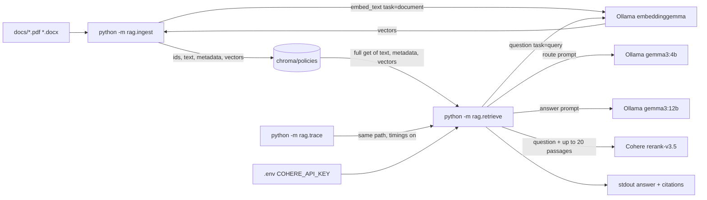

Trust boundary: policy bytes and the Chroma directory stay on the machine. The question text and the candidate passages leave the machine only in the Cohere rerank request. Routing and answering stay on local Ollama. The route model sees the question and the policy catalog. The answer model sees the question and at most three passages.

## 4. Corpus contract

Identity comes from the filename, not from the document body.

```
Doofenshmirtz Evil Inc - {Policy Name} v{Version}.pdf
Doofenshmirtz Evil Inc - {Policy Name} v{Version}.docx
```

`policy_and_version` splits the stem on the last ` v`, then takes the substring after the first ` - `.

```13:17:src/rag/reader.py
def policy_and_version(path: Path | str) -> tuple[str, str]:
    stem = Path(path).stem
    policy, version = stem.rsplit(" v", 1)
    policy = policy.split(" - ", 1)[1]
    return policy, version
```

Integration tests require seven files and these stored names:

| Policy name stored at ingest | Versions |
|---|---|
| HR Policy | 1.0, 2.0 |
| Preparedness Policy | 1.0, 2.0 |
| Time and Usage Policy | 1.0, 2.0 |
| Health Policy | 1.0 |

Ingest is non-recursive. It sorts `directory.iterdir()` and keeps `.pdf` and `.docx` only. A missing directory or zero matching files raises `ValueError` before any model call.

At query time two stored names are folded:

| Stored name | Canonical name used for catalog, filter, and answers |
|---|---|
| Time and Usage Policy | Time & Usage Policy |
| Health Policy | Health & Wellness Policy |

Folding is read-time. Chroma still holds the filename-derived string. The router catalog is built after folding, so the model is shown the canonical names.

## 5. Ingest workflow

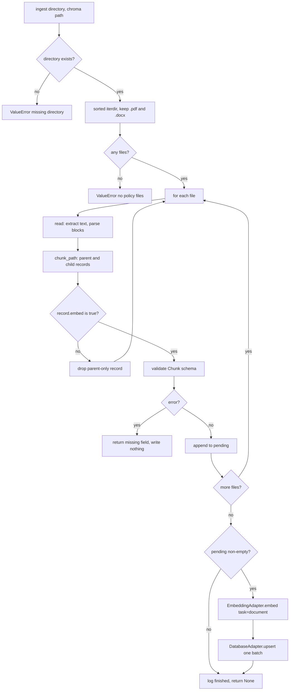

Ordering is the architectural guarantee: every embeddable record is validated before the first embedding request and before the first Chroma write. A bad record aborts the run with exit code 1 and an empty or unchanged collection.

Re-ingest is idempotent. The Chroma id is deterministic:

```
{policy}|{version}|{heading_path}
```

The same id upserts in place. The integration test ingests the corpus twice and asserts the collection count is unchanged.

`ingest.main` defaults `argv[0]` to `docs` and `argv[1]` to `chroma`. A validation string prints to stdout and returns 1. A missing directory or an empty directory raises before that handler.

### 5.1 Read

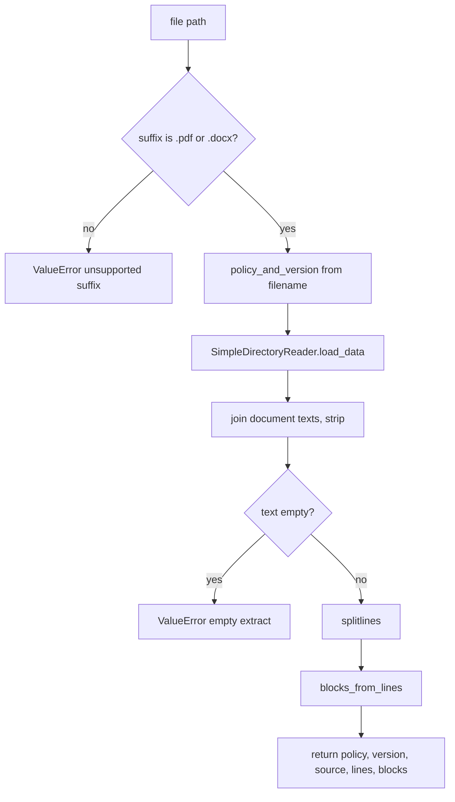

LlamaIndex `SimpleDirectoryReader` extracts text. PDF pages are read with `pypdf` through LlamaIndex `PDFReader`, one document per page, then joined with newlines. Word files are read with `docx2txt` through LlamaIndex `DocxReader`. Structure is recovered with two line regexes. The subsection pattern is tried first.

| Pattern | Example | Level |
|---|---|---|
| `^(\d+\.\d+(?:\.\d+)*)\s+(.*)$` | `3.1 Requirement. Every email...` | dot count + 1 |
| `^(\d+)\.\s+(.*)$` | `1. Purpose. This policy...` | 1 |

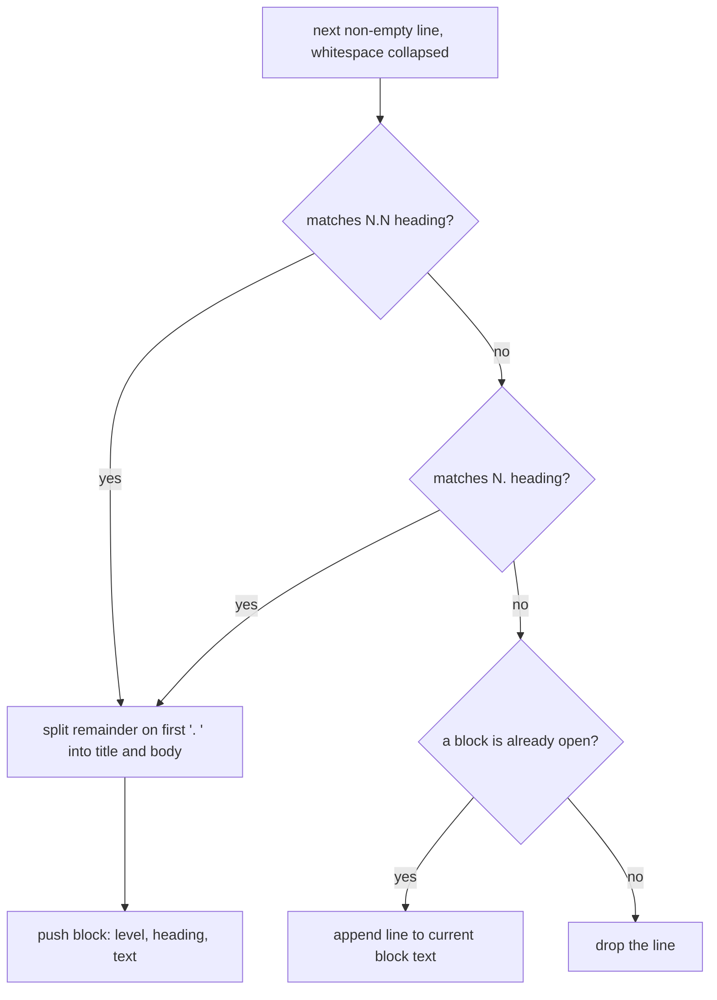

The heading stored on the block is `{number}{separator}{title}`. The separator is `. ` for a top-level section and a single space for a subsection, so headings look like `1. Purpose` and `3.1 Requirement`. A numbered heading that appears before any level-1 heading produces a block, and the chunker later drops it because no section is open. Continuation lines before the first heading are dropped.

### 5.2 Chunk

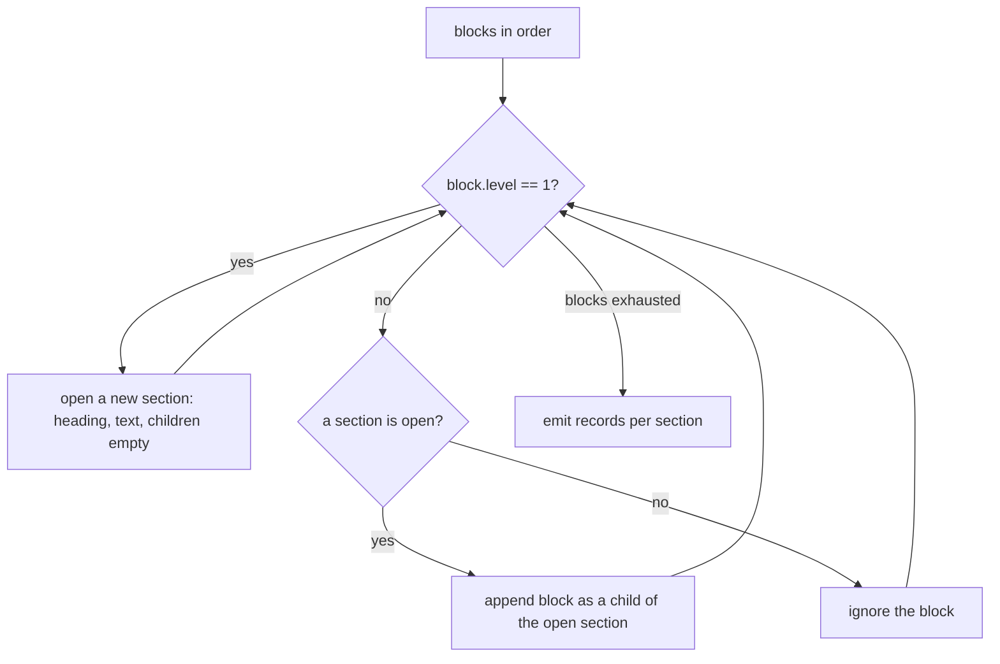

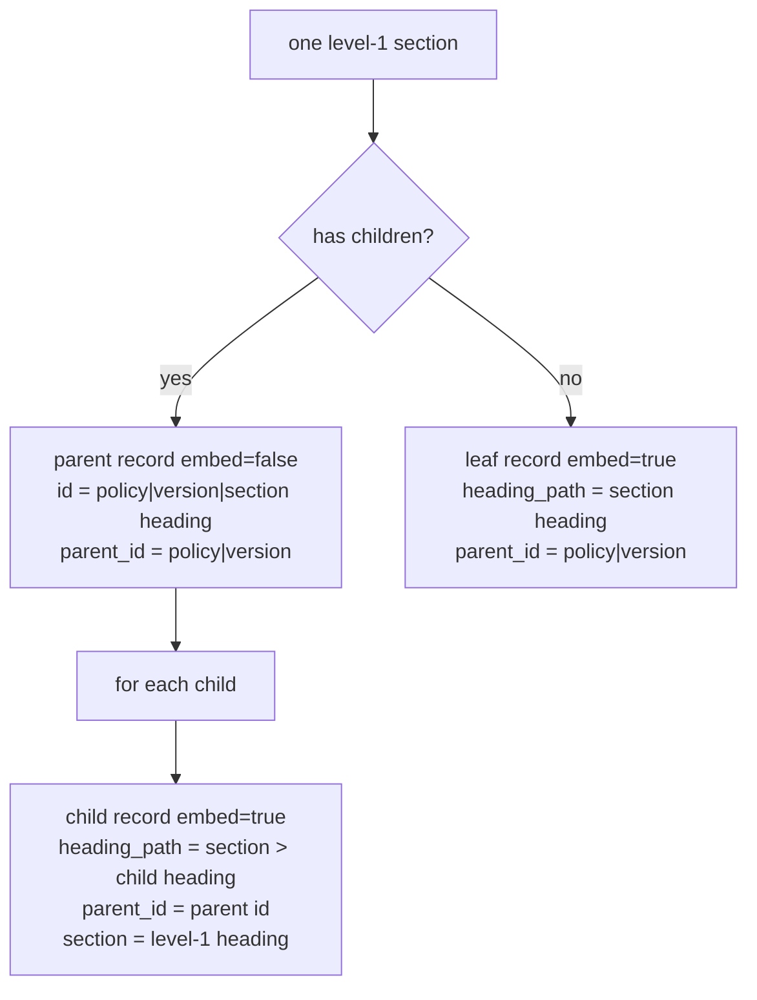

`embed_text` is what the embedding model sees. `text` is what Chroma stores as the document and what BM25, rerank, and the answer model see for lookup:

```
{policy} v{version}
{heading_path}
{text}
```

Heading words are in the vector and absent from the stored passage. A question that uses the section title can still match semantically.

Level 3 does not become a grandchild. Anything that is not level 1 is a direct child of the open level-1 section. `parent_id` is lineage metadata. Parents with `embed=false` are discarded before upsert, and the synthetic document id is never a row. Retrieval does not expand a hit to its parent. This is section-scoped chunk retrieval with a parent pointer.

Worked shape:

```
HR Policy|2.0                              document id, not stored

HR Policy|2.0|3. Email Tone Requirement    parent, embed=false, not stored
HR Policy|2.0|3. Email Tone Requirement > 3.1 Requirement
    embed=true, parent_id points at the section id above

HR Policy|2.0|6. Boss Error Grace Period   leaf, embed=true
    parent_id = HR Policy|2.0
```

### 5.3 Validate

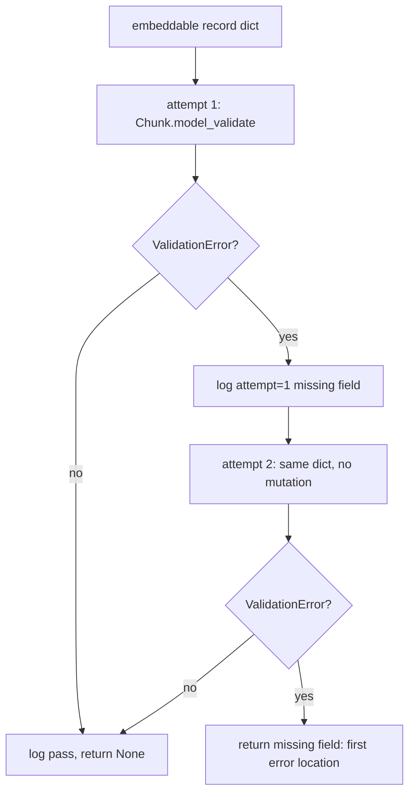

`Chunk` uses `extra="forbid"`. These strings must be non-blank: `id`, `text`, `policy`, `version`, `section`, `heading_path`, `parent_id`, `source`, `embed_text`. `word_count` is an int. `embed` is a bool. A blank string fails the same way a missing conceptual field does: the error text is `missing field: {name}`. The second attempt exists so a persistent failure is logged as `attempt=2`.

### 5.4 Embed

```mermaid
flowchart TD
  texts["list of embed_text"] --> task{"task is document or query?"}
  task -->|no| bad["ValueError"]
  task -->|yes| empty{"texts empty?"}
  empty -->|yes| none["return empty list, no Ollama call"]
  empty -->|no| prefix["prefix every string"]
  prefix --> call["ollama.Client.embed model=embeddinggemma:latest"]
  call --> cast["cast each value to float"]
  cast --> log["log task, count, dimension of first vector"]
```

Prefixes:

| Task | Prefix | Used by |
|---|---|---|
| `document` | `title: none \| text: ` | ingest |
| `query` | `task: search result \| query: ` | retrieve |

Ingest sends one batch for every embeddable chunk in the directory. Query and document vectors must share a dimension. A length mismatch scores cosine 0 for that pair.

### 5.5 Upsert

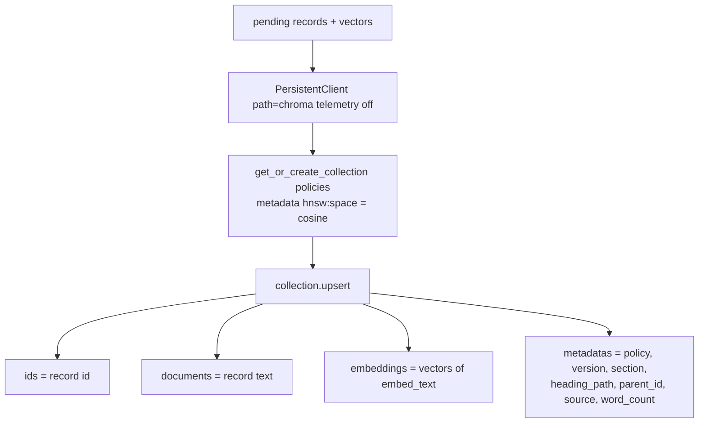

`embed_text` and `embed` are not stored. Query-time code rebuilds what it needs from document plus metadata and always reads the vector back. The HNSW cosine index is created with the collection. The read path does not call `collection.query`.

## 6. Retrieve workflow

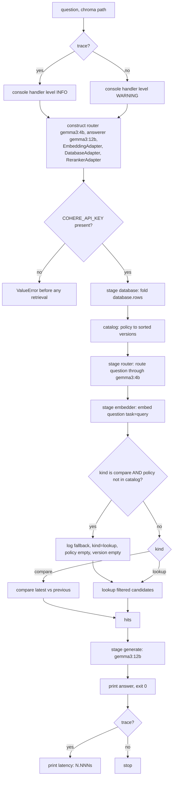

`retrieve.main` lowers the console handler to WARNING, so the operator sees the answer on stdout and not the INFO trace. `trace` raises that handler back to INFO for the duration of the call, then lowers it again in a `finally`. While question logging is on, every `stage(...)` block logs `latency=` for `database`, `router`, `embedder`, `hybrid`, `rerank`, and `generate`. Ingest does not lower the handler, so ingest logs stay visible, and ingest does not wrap its steps in `stage`.

The logger still records router kind, candidate count, and top ids on both commands.

### 6.1 Load, fold, catalog

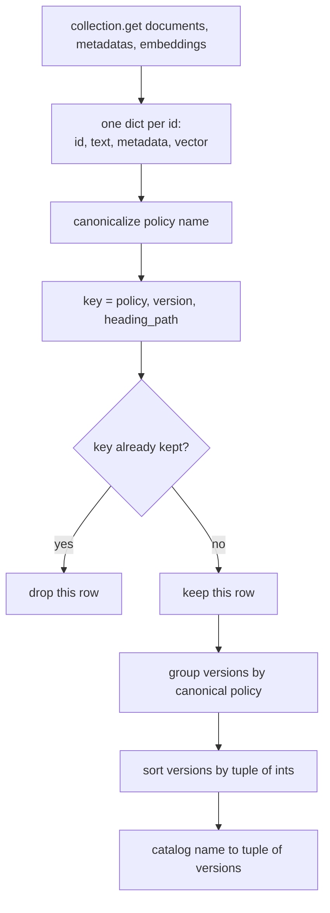

`DatabaseAdapter.rows()` loads the entire collection. There is no `where` filter and no `collection.query`. Every vector is scored in process. That is the correct design for this corpus size, and it is the first scaling limit.

`fold` rewrites policy names through the alias table, then drops later rows with the same `(canonical policy, version, heading_path)`. First row wins. Row order is Chroma id order.

`catalog` sorts with `tuple(int(part) for part in version.split("."))`. `2.0` sorts after `1.0`. `10.0` sorts after `2.0`. A non-numeric version raises during catalog build. Latest is the last tuple. Compare uses `versions[-1]` and, when a second version exists, `versions[-2]`. A third historical version stays in the store and is invisible to compare.

### 6.2 Router

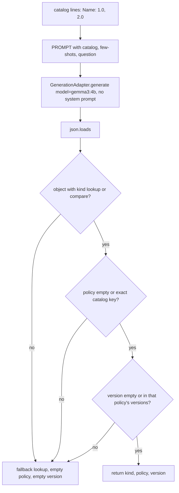

The prompt tells the model to use `compare` only when the question asks what changed, what is new, a diff, or how one version differs from another. A question that names an old version without asking for a change is `lookup`. Policy must be a catalog name or empty. Version is the named version for lookup, or empty.

Examples baked into the prompt:

| Question shape | Decision |
|---|---|
| what changed in HR Policy | compare, HR Policy, version empty |
| what's new in preparedness | compare, Preparedness Policy |
| diff the time policy | compare, Time & Usage Policy |
| how did v2 differ for HR Policy | compare, HR Policy |
| what did HR Policy 1.0 say about leave | lookup, HR Policy, 1.0 |

A second guard in `retrieve` handles compare with an empty policy. The parser allows an empty policy, and an empty policy is not a catalog key, so `retrieve` logs `kind=lookup reason=unknown policy` and clears policy and version. That decision means latest version of every policy.

The router is a classifier with a closed output set. It cannot invent a policy name that survives parsing. It can still pick the wrong catalog name. Nothing checks that choice against the question except the later ranker.

### 6.3 Version filter

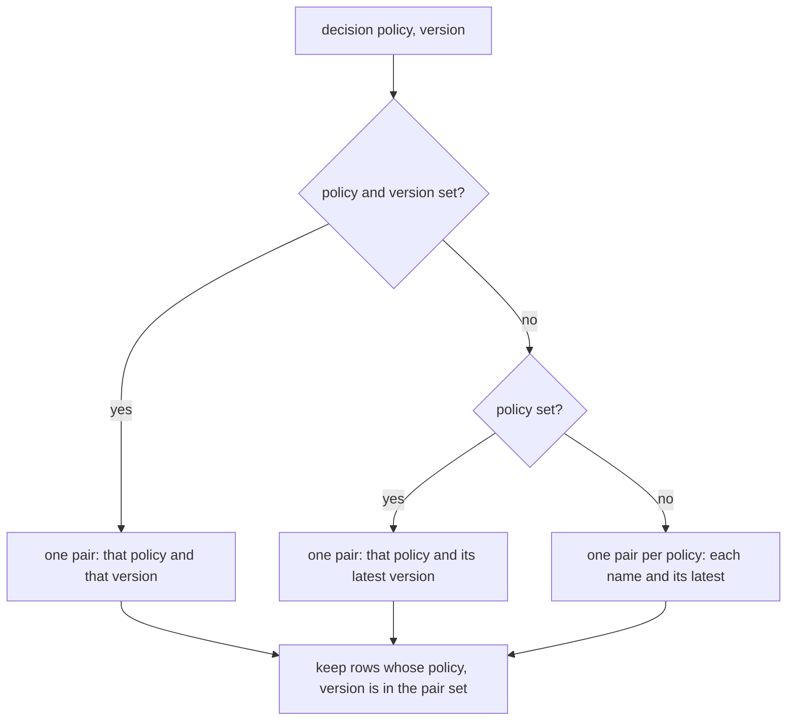

A question that names HR Policy 1.0 never sees 2.0. A question that names no version never sees an old version. Compare ignores `decision["version"]` and always takes latest versus previous of `decision["policy"]`.

## 7. Hybrid rank

Candidates for a lookup, or for one side of a compare, are ranked the same way.

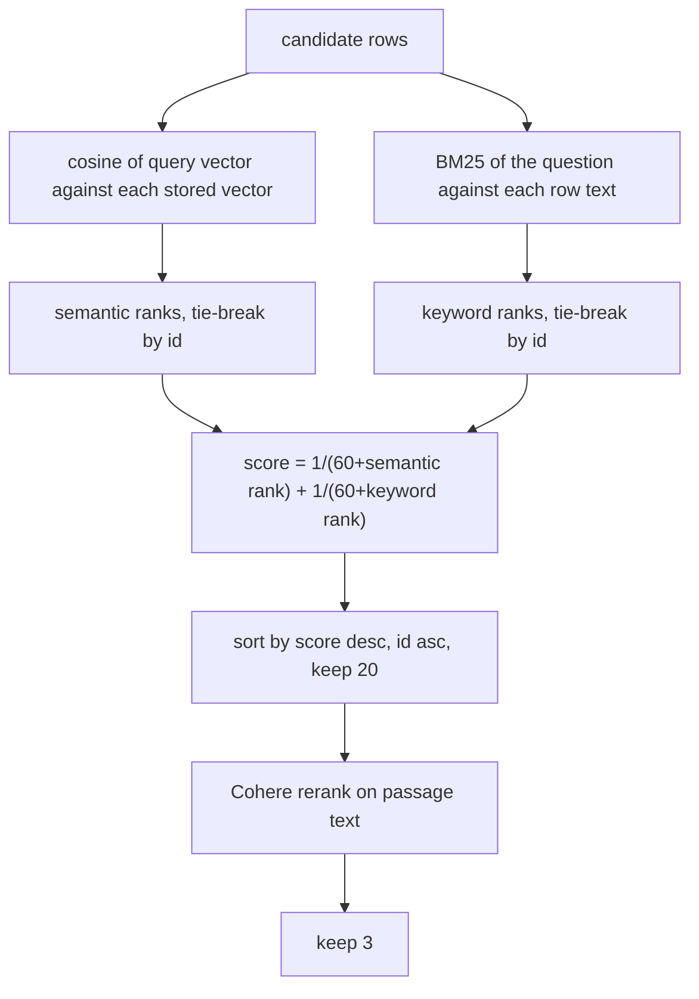

Constants: `RRF = 60`, `FUSE_N = 20`, `TOP_N = 3`. BM25 uses `k1 = 1.5`, `b = 0.75`.

### 7.1 Cosine

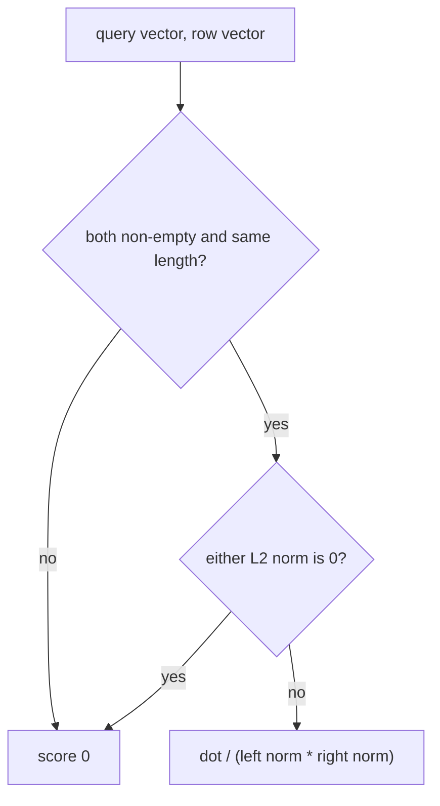

Cosine is computed in Python on the vectors Chroma returned. Rank assignment breaks score ties by ascending id, so fusion is deterministic.

### 7.2 BM25

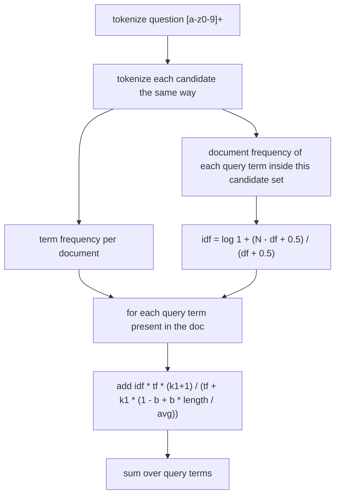

There is no stemmer and no stopword list. IDF is over the candidate set, not over the whole corpus. A term that appears in every candidate in that set still gets a small positive IDF. A term missing from a document contributes nothing. An empty candidate average length yields 0.

RRF is why a keyword hit can beat a nearer distractor. With cosine scores `[0.4, 0.3, 0.2, 0.35]` and BM25 favoring the text `birthday cake`, fusion still places that chunk first.

### 7.3 Rerank

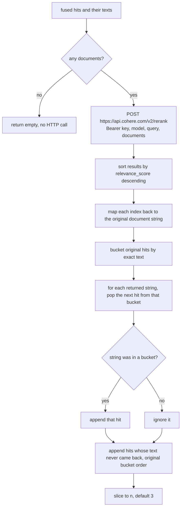

The adapter returns document strings, not scores. Two identical passages stay paired with their own metadata because each returned string pops one hit. A partial Cohere response cannot drop a chunk that fusion already selected. It pushes unrecalled hits behind the ones Cohere returned, and the cut to 3 then decides who is visible. The reranker is constructed at process start and reads the API key immediately, so a missing key fails before retrieval, including the empty-collection path.

## 8. Compare pairing

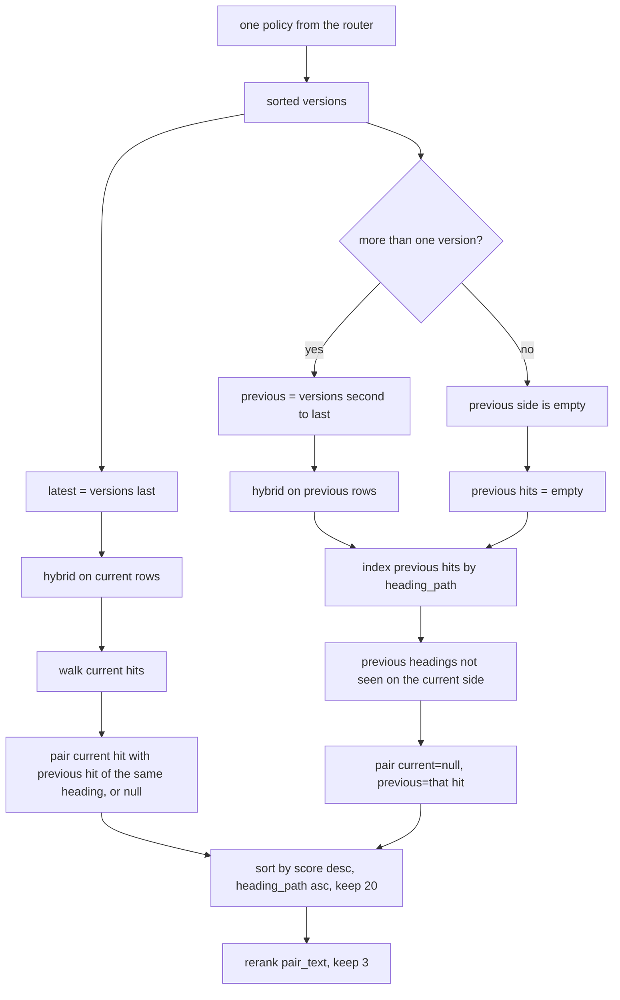

Pair score is the latest side's fusion score. An old-only section inherits the previous side's fusion score. Added sections have `previous: null`. Removed sections have `current: null`.

The rerank document for a pair is:

```
{heading_path}
current {version}
{text}
previous {version}
{text}
```

A missing side is the bare label `current` or `previous`. One-version policies still take the compare path. Every pair has `previous: null`.

With versions `[1.0, 2.0, 3.0]`, compare diffs `3.0` against `2.0`. Version `1.0` stays in Chroma and stays out of this pairing.

## 9. Generation and citations

```mermaid
flowchart TD
  hits["kind + hits"] --> none{"hits empty?"}
  none -->|yes| fixed["return No matching policy text.\nskip the answer model"]
  none -->|no| shape{"kind is compare?"}
  shape -->|yes| pb["pair block: policy, heading, current side, previous side"]
  shape -->|no| cb["chunk block: policy, version, heading_path, text"]
  pb --> body["join blocks with a blank line"]
  cb --> body
  body --> call["generate user prompt with SYSTEM prompt\nmodel gemma3:12b, stream false"]
  call --> cite["append a blank line and citations from metadata"]
  cite --> out["stdout"]
```

The route call and the answer call use separate adapters and separate checkpoints.

| Call | Adapter | Model | System prompt | User content |
|---|---|---|---|---|
| Route | router | `gemma3:4b` | none | catalog, rules, question |
| Answer | answerer | `gemma3:12b` | grounding rules | `Question: …` plus passage blocks |

The system prompt requires the model to use only the passages, say when they do not contain the answer, describe current versus previous text for a comparison, write as few sentences as will carry the rule, and leave policy names, versions, headings, and citations out of the prose.

Lookup block sent to the model:

```
{policy} {version} {heading_path}
{text}
```

Compare block:

```
{policy} {heading_path}
current {version}
{text}
previous {version}
{text}
```

Citation lines, built in code after the model returns:

```
{policy} {version}, {heading_path}
```

Compare emits a line only for a side that exists. An added section cites the current version. A removed section cites the previous version. Citation text comes from metadata, so a policy name invented in the prose cannot change the citation block. The citation block still cites the wrong chunk when retrieval ranked the wrong chunk.

## 10. Whole pipeline on one board

This is ingest and retrieve as one system. The left column runs once per corpus change. The right column runs once per question. Chroma is the only handoff. `rag.trace` is the right column with timings printed.

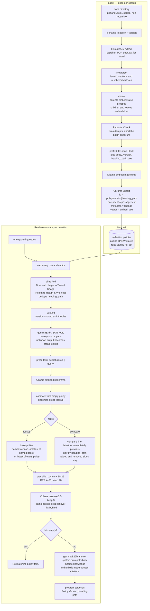

Operator sequence for a lookup, including the two generation calls and the one external call:

```mermaid
sequenceDiagram
  actor Operator
  participant Retrieve as retrieve.main
  participant Chroma
  participant Route as gemma3:4b
  participant Embed as embeddinggemma
  participant Cohere
  participant Answer as gemma3:12b

  Operator->>Retrieve: question
  Retrieve->>Chroma: get all documents, metadata, embeddings
  Chroma-->>Retrieve: rows
  Retrieve->>Retrieve: fold aliases, build catalog
  Retrieve->>Route: route prompt, no system prompt
  Route-->>Retrieve: JSON kind, policy, version
  Retrieve->>Retrieve: reject bad JSON to broad lookup
  Retrieve->>Embed: question with query prefix
  Embed-->>Retrieve: query vector
  Retrieve->>Retrieve: version filter, cosine, BM25, RRF top 20
  Retrieve->>Cohere: question plus up to 20 passage texts
  Cohere-->>Retrieve: texts ordered by relevance
  Retrieve->>Retrieve: reattach metadata, cut to 3
  Retrieve->>Answer: answer prompt plus system prompt
  Answer-->>Retrieve: prose
  Retrieve->>Retrieve: append citations from metadata
  Retrieve-->>Operator: prose, blank line, citation lines
```

Compare inserts one extra hybrid ranking and the heading-path pair step between fusion and Cohere. It does not add a third model call. `trace` adds log lines and a final `latency:` line. It does not add a model call.

## 11. Failure behavior

| Condition | Result |
|---|---|
| Docs directory missing or empty of pdf/docx | `ValueError` before any model call |
| Unsupported or empty file during read | exception, no write |
| Chunk fails validation | exit 1, message `missing field: …`, no embed, no upsert |
| Ollama down on ingest | exception after validation, no upsert |
| Ollama down on retrieve | exception after Chroma read, no answer |
| Router returns garbage, an unknown policy, or an unknown version | broad lookup of every policy's latest |
| Compare with an empty policy | logged fallback to that same broad lookup |
| No candidates or an empty collection | `No matching policy text.` |
| Cohere key missing | `ValueError` at `RerankerAdapter()` construction |
| Cohere returns a subset | missing hits appended, then cut to 3 |
| Cohere returns an unknown string | ignored |
| Same ids ingested again | upsert overwrites, count stable |

Validation failure is all-or-nothing because upsert is one call after the loop. There is no ingest manifest and no embedding-model stamp in metadata. An id that disappears from a later corpus stays in Chroma. Ingest never deletes.

## 12. Operational characteristics

**Latency.** One question costs one local 4B generation, one local 12B generation, one query embedding, one Cohere HTTP round trip, and a full collection read. Ingest costs one batched document embedding and one batched upsert. `python -m rag.trace` prints per-stage `latency=` lines and a total `latency:` line. `retrieve` prints neither.

**Cost.** Ollama is local. The route call is the smaller checkpoint. Cohere is per rerank request, with up to 20 documents on lookup or 20 pair-texts on compare. The answer model sees at most 3 hits.

**Determinism.** Chunk ids, version sort, rank ties, and citations are deterministic. Router and answer text are model outputs. The generation adapter does not set temperature or a seed, so those stay at the Ollama server defaults. Fusion order is deterministic given the same vectors and the same Chroma id order.

**Security.** The CLI has no auth because it is a local process. The Cohere key is the only secret. `.env` is gitignored. The rerank body contains the question and the candidate policy text. The route prompt contains the question and policy names with versions, not passage text.

**Logging.** Every stage logs to logger `ingest`: `reader`, `chunker`, `validate`, `ingest`, `embedder`, `database`, `router`, `retrieve`, `rerank`, `generate`. Format is `timestamp LEVEL step message`. Retrieve silences the console handler unless `trace` is on.

**Test gate.** GitHub Actions runs, in order: `ruff format --check`, `python -m build`, then `pytest`, then a script that reads `results/result.json`. Pytest is configured with `--cov=rag --cov=adpater` and `-m 'not ollama'`. The default suite fakes Ollama and Cohere and uses a temporary Chroma directory. The `ollama` marker is the live eval. The build job does not pass a wheel to the test job. The test job installs the tree editable. Build is a packaging smoke test. The result-file check asserts `totals.recall == 1.0`, `totals.accuracy == 1.0`, and at least 8 rows. CI does not call Ollama or Cohere.

**Python.** `requires-python >= 3.11`. CI uses 3.12. Install path is `pip install -e ".[dev]"` from a src layout.

## 13. Evaluation harness

The live eval is `tests/test_eval.py::test_fixed_set_retrieval_and_answers`, marked `ollama`, so the default `pytest` run skips it. It needs a populated `chroma/` directory, a running Ollama server, and a Cohere key. It calls the same `retrieve` and `generate` functions the CLI uses, with `gemma3:4b` for routing and `gemma3:12b` for answers.

`tests/eval_set.py` holds the cases. Each case has a question, one or more chunk ids that must be retrieved, phrases the answer must contain, and phrases it must not contain. `tests/eval_metrics.py` scores them.

| Score | Definition |
|---|---|
| Recall | overlap of expected keys and retrieved keys, divided by the expected count |
| Accuracy | fraction of questions whose answer contains every required phrase and none of the banned phrases |
| Aggregate | unweighted mean across questions |

Lookup keys are the full chunk id `policy|version|heading_path`. Compare keys are `version|heading_path` for each side that came back, so a paired section can satisfy both the current and previous expected chunks. The test writes `results/result.json` with `totals` and one row per question (`recall`, `answer_ok`, `latency`, `missing_chunks`, `answer`) and fails if any question misses a chunk or a phrase check.

`chunks.json` is a committed catalog of chunk records, including parent records that are not stored in Chroma. The unmarked test `test_eval_set_covers_known_chunks` requires every expected id in the eval set to appear in that file. Query time does not read `chunks.json`.

## 14. Design consequences

These are properties of the current code, in the order they will matter if the corpus or the deployment changes.

1. **Read path is O(corpus).** Moving to `collection.query` plus a metadata `where` on `(policy, version)` removes the full scan. The hybrid BM25 pass still needs the candidate texts. A practical split is Chroma cosine for the semantic leg inside the version filter, and BM25 over that candidate set or over a lexical index with the same filter.

2. **Stale ids survive re-ingest.** A replaced policy file that drops a section leaves the old chunk queryable. A delete-by-source before upsert, or a generation id in metadata, closes that.

3. **Alias fold is a two-entry table.** New filename drift needs a code change. Canonical names are what the router is allowed to emit, so the table and the prompt catalog must move together.

4. **Compare is a two-version window.** `versions[-1]` against `versions[-2]`. Asking how 3.0 differs from 1.0 still diffs 3.0 against 2.0.

5. **`parent_id` is not a retrieval feature.** Implementing small-to-big means storing the parent text and expanding after rerank. Today the parent body of a section that has children is never embedded and never stored.

6. **Routing and answering are already different checkpoints.** The router is `gemma3:4b`. The answerer is `gemma3:12b`. They are separate `GenerationAdapter` instances, so either pin can change without touching the other prompt. The JSON contract can stay. A wrong catalog name still survives parsing. The ranker is the only later check, aside from the empty-policy compare guard.

7. **Citations live outside the model.** Any new UI should render `citations()` as structured fields.

8. **Filename parsing is the schema.** `rsplit(" v", 1)` and `split(" - ", 1)` define policy identity. A sidecar manifest would be the durable catalog. The filename parser is the current one.

9. **The published eval score is a committed file.** CI trusts `results/result.json`. A model or prompt change does not move that file until someone reruns the live eval and commits the new JSON.

## 15. File-level index

| Path | Role |
|---|---|
| `src/rag/ingest.py` | Ingest CLI and validate-then-upsert loop |
| `src/rag/reader.py` | Extract and heading parse |
| `src/rag/chunker.py` | Records, ids, embed flag |
| `src/rag/models.py` | `Chunk` schema |
| `src/rag/validate.py` | Two-attempt validation |
| `src/rag/retrieve.py` | Query CLI, hybrid, compare, trace flag |
| `src/rag/trace.py` | CLI wrapper that sets `trace=True` |
| `src/rag/router.py` | Route prompt and parser |
| `src/rag/generate.py` | Answer prompt, system prompt, citations |
| `src/rag/config.py` | Pinned models, host, collection, `.env` reader |
| `src/rag/logutil.py` | Shared logger and stage timer |
| `src/adpater/embedding_adapter.py` | Ollama embed |
| `src/adpater/generation_adapter.py` | Ollama generate |
| `src/adpater/database_adapter.py` | Chroma |
| `src/adpater/rerank_adapter.py` | Cohere |
| `tests/eval_set.py` | Fixed questions and expected chunks |
| `tests/eval_metrics.py` | Recall and answer scoring |
| `tests/test_eval.py` | Catalog check and live eval |
| `chunks.json` | Committed chunk catalog for the coverage test |
| `results/result.json` | Last live scores; CI asserts perfect recall and accuracy |
| `tests/test_ingest.py` | Corpus contract and abort-on-invalid |
| `tests/test_retrieve.py` | Version filter, aliases, compare pairs, rerank, trace |
| `tests/test_router.py` | JSON fallbacks and the 4B pin |
| `.github/workflows/ci.yml` | format, build, pytest, result-file gate |

## 16. How each technology works

These are the libraries, services, and ranking methods the pipeline depends on, in the order a document and then a question meet them. The first group turns files into stored vectors. The second group turns a question into three passages and a sentence. The last group is the test and packaging toolchain.

### Python

The process is a Python 3.11+ program. `python -m rag.ingest` loads `src/rag/ingest.py` as the `__main__` module and calls `main()`. The same pattern starts retrieve and trace. There is no web framework and no long-running server of our own.

The project uses a src layout. `pyproject.toml` tells setuptools to find packages under `src/`, so `rag` and `adpater` are importable after `pip install -e ".[dev]"`. Editable install means the checkout is the installed code. Type hints such as `list[str]` and `str | None` are the 3.11 forms used throughout the adapters.

`.env` is not loaded by a third-party dotenv library. `rag.config.read_env` reads the file, skips blanks and comments, and splits each line on the first `=`. Process environment wins over the file.

### LlamaIndex

LlamaIndex is a toolkit for loading documents and, in a full install, for indexing and querying them. This project uses one entry point: `SimpleDirectoryReader` from `llama_index.core`.

Given `input_files=[path]`, the reader looks at the suffix, picks a file reader, and returns a list of `Document` objects. Each document has a `.text` string. `rag.reader._load_text` joins those strings with newlines and strips the result. LlamaIndex does not chunk, embed, or retrieve here. Heading structure is recovered by the regex parser in `blocks_from_lines`, because the extractors return plain text and drop heading levels.

PDF files go to LlamaIndex `PDFReader`. Word files go to LlamaIndex `DocxReader`.

### pypdf

`pypdf` is the PDF parser `PDFReader` imports. It is a dependency of `llama-index-readers-file`, not a direct line in `pyproject.toml`.

A PDF is a tree of objects: a cross-reference table, page dictionaries, and content streams of drawing and text operators. `PdfReader` opens that structure. `page.extract_text()` walks the text operators on one page and returns a Unicode string. The default `PDFReader` returns one `Document` per page. This project's reader joins the pages, so a heading that sits at the top of page two is just the next line after the last line of page one.

Extraction does not recover heading styles, tables, or reading order beyond what the content stream encodes. A page with no text layer contributes an empty string. `read` raises `empty extract` only when the joined text is blank.

### docx2txt

`docx2txt` is the Word parser `DocxReader` imports, and it is a direct dependency so the import is guaranteed.

A `.docx` file is a zip archive. The body lives in `word/document.xml` as paragraphs (`w:p`) made of text runs (`w:t`). `docx2txt` unzips the package and concatenates those runs into plain text, with line breaks where the document had paragraphs. Heading styles become ordinary lines. The same two regexes that parse a PDF therefore parse a Word file. Images, comments, and most formatting are discarded.

### Pydantic

Pydantic is the schema check between chunking and embedding. `Chunk` is a `BaseModel` with `extra="forbid"` and a validator on every string field.

`model_validate(record)` checks that every declared field is present, that the types match (`str`, `int`, `bool`), that no extra keys were passed, and that no string is blank after `strip()`. Failure raises `ValidationError`, whose first error location becomes the message `missing field: {name}`. Success returns a `Chunk` instance that `validate()` discards. The dict that was passed in is what gets embedded and upserted. The second attempt runs the same dict again so a persistent failure is logged as `attempt=2`. Nothing is repaired between attempts.

### Ollama

Ollama is a local model server. `ollama pull` downloads a model. The server, default `http://127.0.0.1:11434`, loads the weights and serves HTTP. The Python `ollama` package is a client. `EmbeddingAdapter` and `GenerationAdapter` each construct `ollama.Client(host=OLLAMA_HOST)`.

Two client methods are used:

| Call | HTTP idea | Used for |
|---|---|---|
| `client.embed(model, input)` | embed a batch of strings, return one vector each | document chunks and the question |
| `client.generate(model, prompt, stream=False, system=...)` | run the decoder until it stops, return the full string | route JSON and the answer |

`stream=False` means the adapter waits for the completed response instead of iterating tokens. The route call omits `system`. The answer call passes the grounding rules as `system`, which Ollama treats as a separate instruction channel from the user prompt. The adapter logs the model name and the character count. It does not set temperature, seed, or a token limit.

If the server is down, the client raises and the CLI exits with that exception. Ingest has already validated by then, and it has not upserted.

### EmbeddingGemma

`embeddinggemma:latest` is an embedding model served by Ollama. An embedding model maps a string to a fixed-length list of floats. Texts with similar meaning land near each other. Texts about different subjects land farther apart.

This model expects a task prefix so the query vector and the document vectors occupy the same space. Ingest prefixes every chunk with `title: none | text: `. Retrieve prefixes the question with `task: search result | query: `. The prefix is not stored in Chroma. The vector of the prefixed `embed_text` is what gets stored. `embed_text` itself is `{policy} v{version}`, the heading path, and the passage, so a question that names a section can match even when the stored passage omits the heading.

The adapter casts every component to `float` and logs the dimension of the first vector. Query-time cosine requires that dimension to match the stored vectors. A mismatch scores 0.

### Gemma 3

`gemma3:4b` and `gemma3:12b` are decoder-only language models, also served by Ollama. A decoder reads the prompt and repeatedly predicts the next token until it stops. The 4B and 12B sizes are the same family at two scales. The smaller one is the router. The larger one writes the answer.

The router is asked for one JSON object: `kind`, `policy`, `version`. Few-shot lines in the prompt show the legal shapes. `parse_route` then `json.loads` the string and rejects anything that is not an object, whose `kind` is not `lookup` or `compare`, or whose policy or version is not in the catalog. A model that chats instead of emitting JSON becomes a broad lookup. The 4B checkpoint is large enough for that closed classification and cheaper than running the 12B model twice.

The 12B checkpoint receives the grounding system prompt and the passage blocks. It is instructed to stay inside those passages, to describe current versus previous text on a comparison, and to leave citations out of the prose. Citations are appended in Python from hit metadata after the model returns. Empty retrieval never calls this model.

### ChromaDB

Chroma is an embedded vector store. `PersistentClient(path=...)` opens a directory on disk and stores the collection there, with telemetry turned off. `get_or_create_collection("policies", metadata={"hnsw:space": "cosine"})` opens the collection or creates it with cosine as the index distance.

Each stored row has four parts:

| Part | Contents |
|---|---|
| id | `policy\|version\|heading_path` |
| document | passage `text` only |
| embedding | vector of `embed_text` |
| metadata | policy, version, section, heading path, parent id, source, word count |

`upsert` inserts or replaces by id, which is why a second ingest of the same files does not grow the collection. `rows()` calls `collection.get` for every document, metadata dict, and embedding. The query path never calls `collection.query`, so the HNSW graph is built and then unused. Scoring happens in `retrieve.py` on the vectors that `get` returned. That is simple and exact for this corpus, and it reads the whole collection on every question.

Chroma does not delete rows that a later ingest omits. Identity is the id. A dropped section stays queryable until something deletes it.

### HNSW

HNSW (hierarchical navigable small world) is the index Chroma builds for a collection. It is a stack of graphs. The top layer is sparse. Lower layers are denser. A search starts at the top and greedily walks toward the query vector, then drops a layer and repeats. The `hnsw:space` metadata tells that walk to use cosine distance.

Approximate search is why a vector database can avoid comparing the query with every row. This project does not take that tradeoff. It compares the query with every stored vector in Python, which is exact and fine while the policy set is small. The index is still created, so a later switch to `collection.query` would already have cosine HNSW in place.

### Cosine similarity

Cosine similarity measures the angle between two vectors and ignores their length. The score is the dot product divided by the product of the L2 norms:

```
dot(a, b) / (||a|| * ||b||)
```

A score of 1 means the same direction. A score of 0 means a right angle. Negative means opposite directions. `cosine()` returns 0 when either vector is empty, the lengths differ, or either norm is 0. Those guards keep a bad vector from raising or from dominating the rank.

Ranks are assigned by sorting score descending and id ascending, then numbering from 1. The raw cosine value is not what fusion uses. The rank is.

### BM25

BM25 is a lexical ranker. It scores a document by how often the question's words appear in it, with two corrections and an IDF weight. The implementation lives in `bm25_scores`. There is no BM25 library.

Tokenization is `[a-z0-9]+` on the lowercased string. There is no stemmer and no stopword list, so `cake` matches `cake` and does not match `cakes`.

For each query term that appears in a candidate:

| Piece | What it does | Setting |
|---|---|---|
| Term frequency | How many times the term occurs | counted per candidate |
| Saturation `k1` | Extra repeats help less and less | 1.5 |
| Length norm `b` | A long candidate is discounted relative to the average length | 0.75 |
| IDF | A term that appears in fewer candidates counts more | `log(1 + (N - df + 0.5) / (df + 0.5))` |

IDF is computed on the candidate set for that question, not on the whole corpus. After the version filter, "every policy's latest" and "this one old version" therefore weight words differently. A term in every remaining candidate still gets a small positive IDF. A term absent from a candidate adds nothing. If the average length is 0, every score is 0.

BM25 sees `row["text"]`, the stored passage. It does not see the heading path. A question that only shares words with the heading has to win on cosine, where the heading was part of `embed_text`.

### Reciprocal rank fusion

Cosine scores and BM25 scores are not on the same scale, so adding them would let one method drown the other. Reciprocal rank fusion ignores the scores and uses the ranks:

```
score = 1 / (60 + semantic_rank) + 1 / (60 + keyword_rank)
```

`k = 60` keeps a first-place finish from dominating. A chunk that is rank 1 on keywords and rank 20 on cosine can still beat a chunk that is rank 2 on cosine and absent from the useful keyword ranks. Ties in the fused score break by ascending id. The top 20 fused hits are what Cohere sees. Fusion is deterministic for a given set of vectors and a given Chroma id order.

### Cohere Rerank

Cohere's rerank API is a cross-encoder served over HTTPS. A bi-encoder, which is what EmbeddingGemma is, encodes the question and the passage separately and compares the vectors. A cross-encoder reads the question and one passage in a single pass and emits a relevance score. That is slower and more accurate, which is why it runs on 20 candidates and not on the whole collection.

`RerankerAdapter` posts JSON to `https://api.cohere.com/v2/rerank`:

```
{"model": "rerank-v3.5", "query": "<question>", "documents": ["<passage>", ...]}
```

The key is `Authorization: Bearer <COHERE_API_KEY>`. The HTTP client is the standard library `urllib.request`, not a third-party HTTP package. The response lists each document index with a `relevance_score`. The adapter sorts by that score descending and returns the original document strings. `apply_rerank` maps those strings back onto hits, keeps hits Cohere omitted at the back of the list, and slices to 3.

On a compare, the document is the pair text (heading, current side, previous side), so the cross-encoder scores the change, not a single passage. The model name can be overridden with `COHERE_RERANK_MODEL`. A missing key raises at construction, before any retrieval.

### pytest, ruff, and GitHub Actions

`pytest` discovers `tests/`. `pythonpath = ["src"]` makes `rag` and `adpater` importable without an install inside a local run, and CI installs the tree editable anyway. Default `addopts` enable coverage on both packages and exclude tests marked `ollama`. Unit tests pass fake clients into the adapters, so they never open a socket to Ollama or Cohere. Chroma tests use a temporary directory.

`ruff format --check` is the style gate. The project sets target Python 3.11 and a line length of 88. CI does not run a separate lint command.

GitHub Actions has three jobs. `format` installs ruff and checks formatting. `build` runs `python -m build` and does not hand the wheel to the next job. `test` installs `.[dev]`, runs `pytest`, then asserts that the committed `results/result.json` still reports recall 1.0 and accuracy 1.0. The live eval that produces that file is opt-in.
