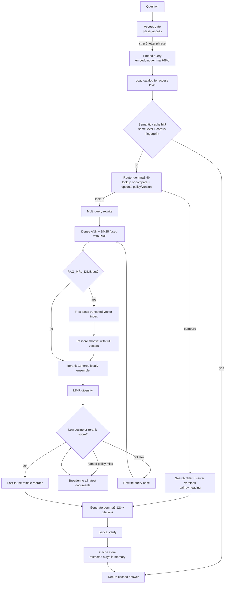
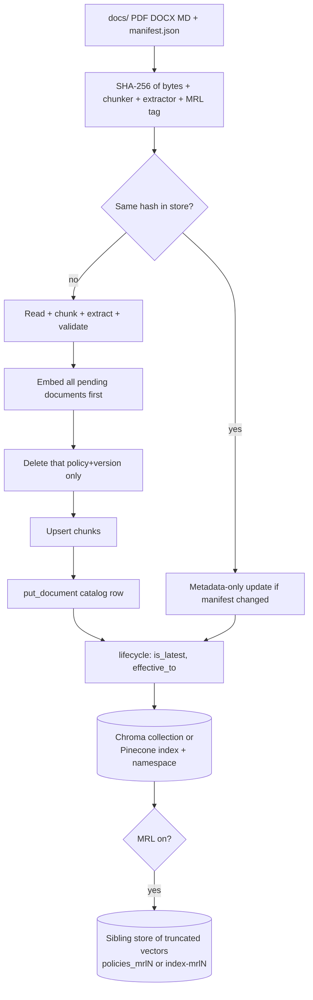
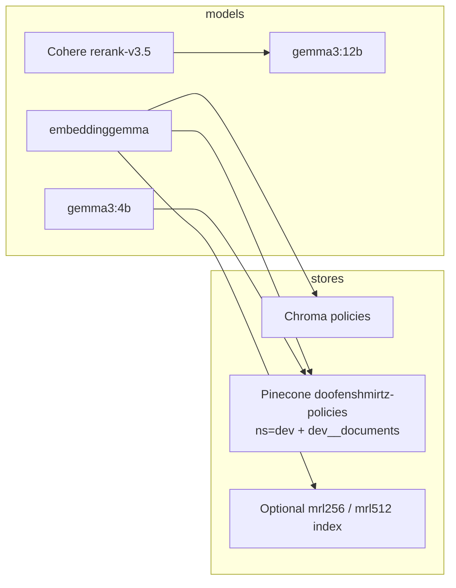

# Workflow: current RAG structure

This is the pipeline as implemented on `feat/enterprise-upgrade` (`src/rag/pipeline.py`, `src/rag/retrieve.py`, `src/rag/ingest.py`). `ARCHITECTURE-RAG.md` describes the earlier Chroma-only v1.

## Question answering

Access levels: without the phrase, only `public` / `internal`. With `RAG_ACCESS_PHRASE` as the first word, `top-secret` is included. The phrase never reaches the router, models, cache, or feedback file.

## Ingest

Failed embeds abort before any delete. `admin retire|restore` writes `admin_status`, which survives re-ingest.

## Stores and models

| Command | Role |
| --- | --- |
| `python -m rag.ingest` | Read `docs/`, write the configured store |
| `python -m rag.retrieve "…"` | Answer one question |
| `python -m rag.trace "…"` | Same path, plus per-step latency / tokens / cost |
| `python -m rag.admin list\|retire\|restore\|purge` | Document lifecycle |
| `python -m rag.feedback up\|down` | Rate the last answer |

Switch backend with `RAG_DB_BACKEND=chroma|pinecone` and Matryoshka with `RAG_MRL_DIMS=0|128|256|512`. After changing MRL dims, ingest again so the sibling index is filled.
