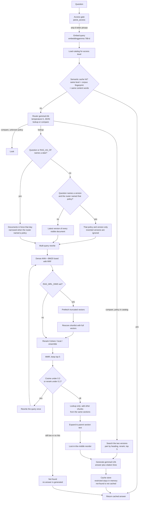
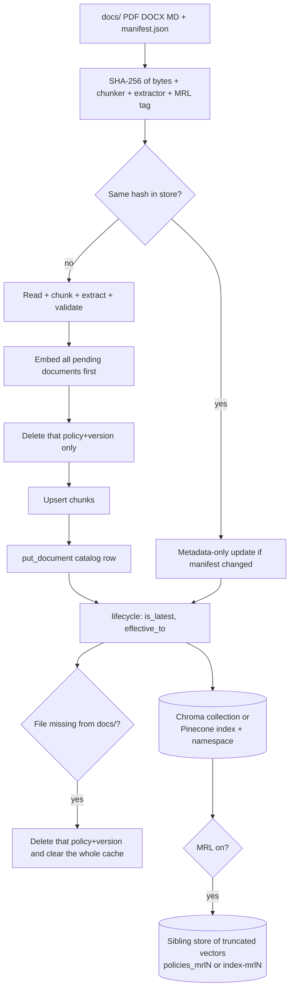
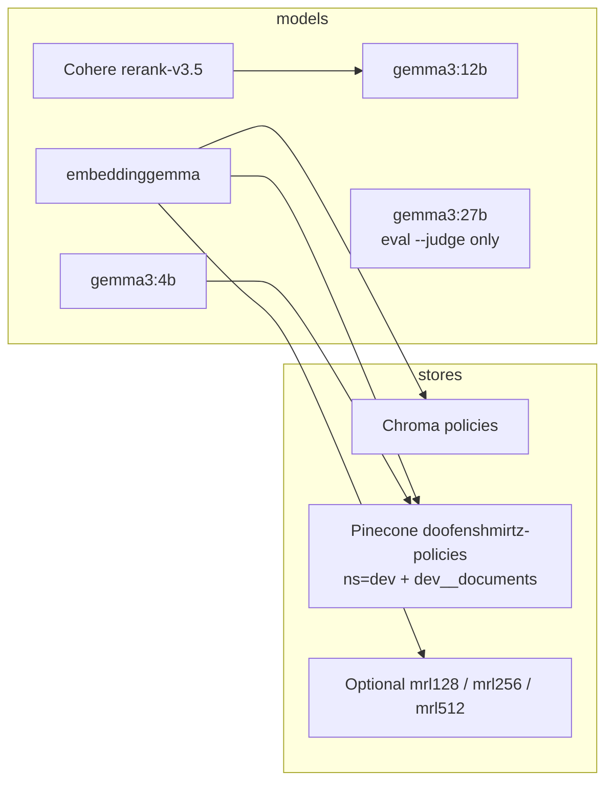

# Workflow: current RAG structure

Pipeline as implemented now (`src/rag/pipeline.py`, `src/rag/retrieve.py`, `src/rag/ingest.py`). Setup, env vars, and commands are in README.md. This checkout answers from Pinecone (`doofenshmirtz-policies`, namespace `dev`) with Matryoshka prefetch at 512 dimensions. `RAG_TOP_N` is 5.

## Question answering

A lookup does not trust the router to pick the document. The router still decides lookup versus compare, and it still names the policy for a compare and for a version the question itself names ("what did HR Policy 1.0 say"). "What changed between the current and previous version" stays on the compare path: no version numbers means previous versus latest.

After retrieval, section siblings can make the prompt longer than 5 chunks. The policy desk (`python -m rag.server`) shows at most 5 citation cards, in the order the passages were given to the model. The page is read from disk on each request. The server process keeps the Python it imported at startup, so restart it after a code change.

Access levels: without the phrase, only `public` / `internal`. With `RAG_ACCESS_PHRASE` as the first word, `top-secret` is included. The phrase never reaches the router, models, cache, or feedback file.

## Ingest

Failed embeds abort before any delete. `admin retire|restore` writes `admin_status`, which survives re-ingest.

## Stores and models

From this container, Ollama is at `OLLAMA_HOST=http://host.docker.internal:11434`.

| Command | Role |
| --- | --- |
| `python -m rag.ingest` | Read `docs/`, write the configured store |
| `python -m rag.retrieve "…"` | Answer one question |
| `python -m rag.trace "…"` | Same path, plus per-step latency / tokens / cost |
| `python -m rag.server` | Policy desk at http://127.0.0.1:8000 |
| `python -m rag.admin list\|retire\|restore\|purge` | Document lifecycle |
| `python -m rag.feedback up\|down` | Rate the last answer |
| `python scripts/run_eval.py` | Offline eval |
| `python scripts/run_eval.py --live` | Live eval, writes `results/result.json` |

Switch backend with `RAG_DB_BACKEND=chroma|pinecone` and Matryoshka with `RAG_MRL_DIMS=0|128|256|512`. After changing MRL dims, ingest again so the sibling index is filled.

## Eval

`tests/eval_set.py` is the fixed set: original handbook, new documents, named-version lookups, compares, restricted questions, and leak checks. Recall, MRR, and nDCG are scored on the reranked retrieval list, before siblings are inserted and before lost-in-the-middle reorders the prompt. Answer checks use word boundaries, so a comma after a word still counts and `1,000` does not match inside `1,000,000`.

Last live run (`results/result.json`, k=5): recall 1.000, MRR 0.947, nDCG 0.960, accuracy 1.000, citation 1.000, routing 1.000, leaks 0. Median latency 22.3s, p95 29.0s.
